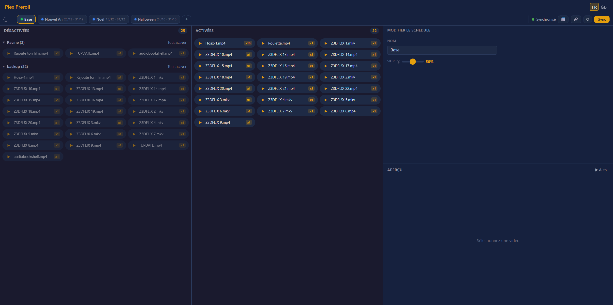

# Plex Preroll Manager

Web interface to dynamically manage Plex Media Server pre-rolls. Schedule seasonal videos, set per-video frequency weights, and automatically sync your Plex configuration.




---

## Features

### Video management

- **Two columns** — enabled videos (included in the Plex rotation) and disabled videos
- **Drag & drop** between columns to enable / disable a video
- **Collapsible subfolder groups** with bulk actions (enable all / disable all)
- **Cycling weight badge** on each video: `x1 → x2 → x5 → x10 → x1` — sets the relative probability of the video appearing in the Plex playlist

### Preview

- **Auto mode** — click a video → immediate playback in the integrated player
- **Pause mode** — click a video → loads and displays the first frame without playing
- Visual selection (highlighted pill) of the currently previewed video
- Displays filename and relative path

### Seasonal schedules

- **Schedule tabs** — one base schedule + N custom schedules (via the `+` button)
- Each schedule has: name, priority, start date, end date, ON/OFF toggle
- **ON/OFF toggle** saves directly via API without going through the Sync button
- **Inline editor** in the preview panel: name, priority, date range, skip
- **Skip slider** — probability of playing no pre-roll at all (0 % = always played, 100 % = never played)
- **Color indicator** per tab: green (active), orange (lower priority), grey (out of period / OFF)
- **Sync button** — saves video list changes to Plex
- Cancel / Save / Delete buttons at the bottom of the schedule editor

### Annual calendar

- 12-month grid view (4×3), opened via the 📅 button
- Each day is colored by the active schedule (priority resolution applied)
- December → January wrap-around handled
- Current day highlighted
- Legend with per-schedule color dots

### Plex configuration

- **🔗 button** — shows the current `CinemaTrailersPrerollID` value read from the Plex API
- **↻ button** — rescans the preroll folder without restarting
- Plex playlist automatically synced after Sync

### UI

- **Bilingual FR / EN** — automatic browser language detection, manual switcher
- Global status indicator (synced / unsaved / error) with colored dot
- No frontend dependencies (vanilla JS / CSS, no framework)

---

## Quick start

### Docker Compose

```yaml
services:
  plex-preroll:
    image: monsieurzed/plex-preroll:latest
    container_name: plex-preroll
    environment:
      - PLEX_URL=http://<PLEX_IP>:32400
      - PLEX_TOKEN=<YOUR_PLEX_TOKEN>
      - PLEX_PREROLL_PATH=/prerolls
    volumes:
      - ./data:/data
      - /path/to/your/prerolls:/prerolls:ro
    ports:
      - "3000:3000"
    restart: unless-stopped
```

Access at `http://<HOST>:3000`

### Environment variables

| Variable            | Required | Description                                                                                                                           |
| ------------------- | -------- | ------------------------------------------------------------------------------------------------------------------------------------- |
| `PLEX_URL`          | ✅       | URL of your Plex server, e.g. `http://192.168.1.10:32400`                                                                             |
| `PLEX_TOKEN`        | ✅       | Plex authentication token ([how to get it](https://support.plex.tv/articles/204059436-finding-an-authentication-token-x-plex-token/)) |
| `PLEX_PREROLL_PATH` | ✅       | Path to the prerolls folder as Plex sees it on the host (left side of the volume mount)                                               |

### Volumes

| Volume                           | Description                                             |
| -------------------------------- | ------------------------------------------------------- |
| `./data:/data`                   | JSON config storage (schedules, weights, probabilities) |
| `/path/to/prerolls:/prerolls:ro` | Video files folder (read-only recommended)              |

---

## Architecture

Single Docker image (`python:3.12-slim`) combining:

- **nginx** — serves the static frontend on port 3000, reverse-proxies to the API
- **uvicorn + FastAPI** — REST API on port 8000 (internal)
- **supervisord** — manages both processes

---

## Local development

```bash
git clone https://github.com/MonsieurZed/plex-preroll.git
cd plex-preroll
docker compose up -d --build
```

---

## License

MIT
